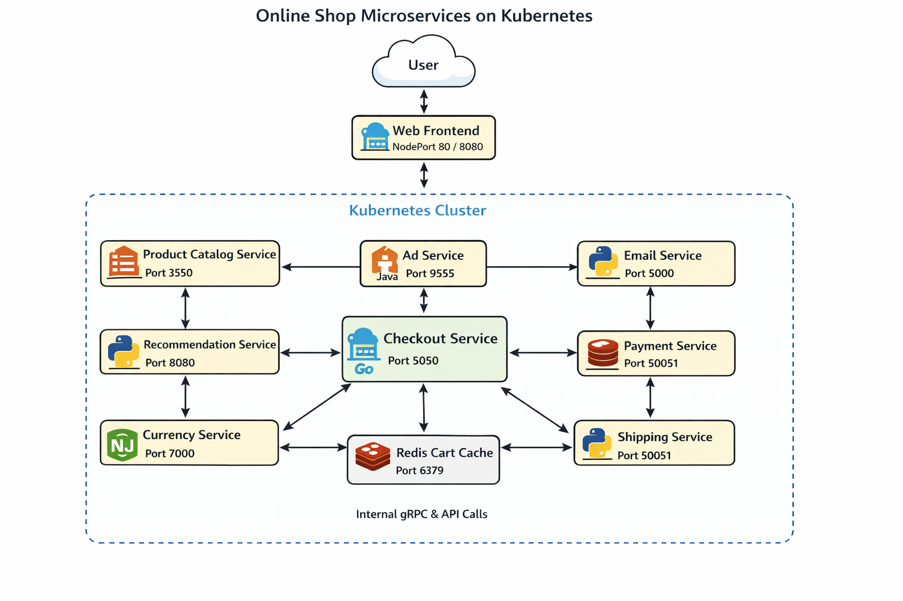

# 🛒 Online Shop Microservices – Kubernetes & Helmfile Deployment

## 📌 Project Overview
This repository demonstrates a DevOps-focused deployment of a cloud-native Online Shop microservices application using Kubernetes, Helm, and Helmfile.

The application source code is not included. This repository focuses purely on infrastructure, orchestration, and deployment.

---

## 🧩 Architecture Diagram

  

### Architecture Highlights
- Frontend exposed externally via NodePort
- Backend services communicate internally using ClusterIP services
- Checkout service orchestrates business flow
- Redis stores cart data
- Helm charts reused for stateless services
- Helmfile manages orchestration

---

## 🔁 Request Flow (User → Services)

1. User accesses the application via browser
2. Request reaches Frontend service (NodePort)
3. Frontend calls:
   - Product Catalog Service
   - Recommendation Service
   - Cart Service
4. Checkout Service coordinates:
   - Cart Service
   - Payment Service
   - Shipping Service
   - Email Service
   - Currency Service
5. Cart data is persisted in Redis
6. Response is aggregated and returned to user

---

## 🔗 Original Application Source
The microservices application is maintained by Google Cloud:
https://github.com/GoogleCloudPlatform/microservices-demo

This repository focuses exclusively on Kubernetes and DevOps deployment practices.

---

## 👤 Author
Shreyansh Saxena – DevOps Engineer
